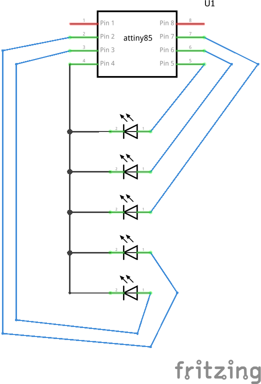

## Persistence of Vision

### Set the clock speed on the ATTiny85
8MHz is too fast, ideally only need 1MHz, to set the clock speed on the ATTIny85 to 1MHz, run the following command:

    sudo avrdude -c usbasp -p attiny85 -U lfuse:w:0x62:m -U hfuse:w:0xdf:m -U efuse:w:0xff:m

Just be sure to change the -c parameter to what ever programming method you are using, I'm personally using a USBAsp II ISP programmer.

